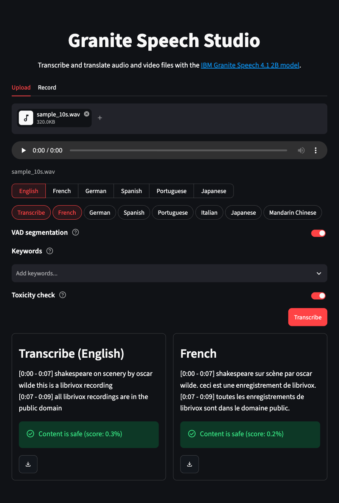

# Granite Speech Studio

[](https://github.com/darylalim/granite-speech-studio/actions/workflows/ci.yml)
[](LICENSE)
[](https://www.python.org/downloads/)

Streamlit application for transcription and translation using IBM Granite Speech on Apple Silicon with MLX.

<p align="center">
  
  
</p>
<p align="center"><em>Transcription + French translation of a sample clip, shown in the light and dark themes.</em></p>

## Features

- **Pipeline processing** — run multiple transcription and translation tasks on the same audio in one pass over the file
- **Transcription** — English, French, German, Spanish, Portuguese, Japanese
- **Translation** — English ↔ French, German, Spanish, Portuguese, Italian, Japanese, Mandarin Chinese (Italian and Mandarin: English source only)
- **Keywords** — bias recognition toward up to 15 user-provided terms (proper nouns, acronyms, jargon)
- **VAD segmentation** — automatic speech detection with timestamped per-segment output, capped at 8s per segment so translation stays accurate on continuous speech (togglable; disable to process whole audio in one pass; auto-required for audio over 2 minutes)
- **Toxicity check** — togglable (on by default); surfaces the worst per-segment toxicity score on any output that may be English via Granite Guardian HAP 125m
- **Source language** — pick once; valid tasks update accordingly
- **Audio input** — upload audio (WAV, FLAC, M4A, MP3, OGG, AAC) or video (MP4, MOV, WebM, MKV — audio track is extracted) or record from microphone
- **Side-by-side results** — compare outputs in a column grid (up to 3 columns)
- **Themed UI** — cohesive IBM Carbon-inspired theme with automatic light and dark modes
- **Deferred loading** — models load on first pipeline run for instant page startup
- **Export** — download per-task transcriptions and translations as text

## How it works

Three models run as a pipeline, loaded on first run and cached thereafter:

| Model | Role | Runs on |
|-------|------|---------|
| [Granite Speech 4.1 2B (8-bit, MLX)](https://huggingface.co/divydeep/granite-speech-4.1-2b-mlx-8bit) | Transcription and translation | Apple GPU (MLX) |
| [Silero VAD v6](https://huggingface.co/mlx-community/silero-vad-v6) | Splits audio into speech segments | Apple GPU (MLX) |
| [Granite Guardian HAP 125m](https://huggingface.co/ibm-granite/granite-guardian-hap-125m) | English toxicity detection | CPU |

Audio is loaded and resampled to 16 kHz mono, optionally segmented with VAD, then transcribed and translated segment-by-segment on the GPU. VAD runs on the GPU too, batching its encoder across chunks so a whole clip costs a couple of model calls rather than one per 32 ms; it falls back to the PyTorch build of the same checkpoint, on CPU, if the MLX weights are unavailable. Each segment is encoded once and reused across every selected task, so N tasks cost one audio encode rather than N. Any output that may be English is scored for toxicity.

## Requirements

- Apple Silicon Mac (M1/M2/M3/M4)
- Python 3.12+
- [uv](https://docs.astral.sh/uv/) — Python package manager (`curl -LsSf https://astral.sh/uv/install.sh | sh`)
- [FFmpeg](https://ffmpeg.org/) — `brew install ffmpeg` (required: `torchcodec` loads FFmpeg's shared libraries at import time, so the app won't start without it)

## Setup

```bash
brew install ffmpeg   # required at runtime by torchcodec
uv sync
uv run streamlit run streamlit_app.py
```

> First run downloads the Granite Speech model (~3.3 GB) plus the VAD and guardian models, then caches them; inference runs on the Apple Silicon GPU.

## Usage

> New here? Try it with the bundled sample clip: `tests/data/audio/sample_10s.wav`.

1. Upload an audio or video file, or record from your microphone
2. Pick the source language of your audio
3. Pick tasks (transcribe, translate to a language)
4. Optionally toggle **VAD segmentation** (on by default)
5. Optionally add **Keywords** (proper nouns, acronyms, jargon)
6. Optionally toggle **Toxicity check** (on by default)
7. Click **Transcribe** to process all selected tasks
8. View side-by-side results and download as text

## Notes

- **Apple Silicon only** — inference uses MLX; there's no CUDA or CPU-only fallback.
- **Translation pivots through English** — English ↔ X only; no direct X → Y (e.g. French → German).
- **Toxicity detection is English-only** (Granite Guardian HAP). Because English audio can come back untranslated, every task is checked when the source is English; non-English sources are checked only for translations into English.
- **Upload limit 500 MB**; with VAD off, clips are capped at 2 minutes — a single inference that long already peaks around 14 GB of memory.
- **Translation needs VAD on.** Past roughly 20 seconds in one pass the model stops translating and echoes the source language back verbatim, with no error. VAD segmentation keeps every chunk under 8s, which is why it defaults to on.

## Development

```bash
uv run ruff check .     # lint
uv run ruff format .    # format
uv run ty check         # type-check
uv run pytest           # run tests
```

## Resources

- [Granite Speech 4.1 2B](https://huggingface.co/ibm-granite/granite-speech-4.1-2b) — IBM's model card
- [Granite Speech 4.1 2B (8-bit, MLX)](https://huggingface.co/divydeep/granite-speech-4.1-2b-mlx-8bit) — the community MLX conversion this app loads
- [Granite Speech collection](https://huggingface.co/collections/ibm-granite/granite-speech)
- [Technical report](https://arxiv.org/abs/2505.08699)

## Acknowledgements

- [IBM Granite](https://huggingface.co/ibm-granite) — Speech and Guardian models
- [Silero VAD](https://github.com/snakers4/silero-vad) — voice activity detection ([MLX port](https://huggingface.co/mlx-community/silero-vad-v6))
- [Apple MLX](https://github.com/ml-explore/mlx) and [mlx-audio](https://github.com/Blaizzy/mlx-audio) — on-device inference
- [Streamlit](https://streamlit.io/) — web UI

## License

Licensed under the [Apache License 2.0](LICENSE). See [NOTICE](NOTICE) for third-party attributions.
